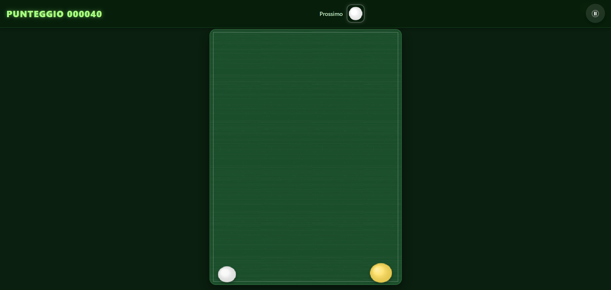

<h1 align="center">Ball Drop</h1>

    
  

  

Ball Drop è un semplice videogioco open source di tipo Merge game, in cui devi far cadere palle sportive, unirle a coppie e farle evolvere da piccole a giganti! Più le unisci, più diventano grandi, più punti fai, ma occhio a non superare la linea rossa semmò game over.

## Funzionamento  
Il gioco si basa su una meccanica semplice ma coinvolgente: ogni volta che fai clic (o tocco su mobile), una palla cade dal cielo. Quando due palle dello stesso tipo si toccano, si fondono in una palla più grande del livello successivo, da golf a palla medica. Il punteggio aumenta a ogni fusione.

Con il passare del tempo e l’aumentare del punteggio, il gioco diventa più difficile:  
- La gravità aumenta  
- Il rimbalzo delle palle diminuisce  
- La zona pericolosa in alto si espande, riducendo lo spazio disponibile  

Se una palla entra nella zona rossa in alto, il gioco termina.

### Palle speciali  
Il gioco include palle speciali che aggiungono strategia e varietà:  
- Bomba: non si fonde, ma esplode distruggendo le palle vicine  
- Palla di Vetro: dà il triplo dei punti quando si fonde, ma, essendo fatta di vetro, si rompe se tocca terra  
- Palla Vortice: attira le palle vicine per 2 secondi dopo il merge
- Detonatore: come con la bomba, se collide con un altro detonatore, fa scoppiare tutte le bombe-

Queste palle appaiono casualmente una volta raggiunto un certo livello.

### Come giocare  
1. Clicca o tocca lo schermo per far cadere una palla  
2. Cerca di posizionarla in modo da unirla a una palla uguale  
3. Continua a fondere per salire di livello e aumentare il punteggio  
4. Evita che le palle raggiungano la zona rossa in alto  

Obiettivo: ottenere il punteggio più alto possibile!

## Tecnologie utilizzate  
- HTML5: struttura e canvas per il rendering  
- JavaScript: logica di gioco, fisica, collisioni, UI  
- CSS: stile, effetti visivi e layout responsive  

Il gioco è realizzato in un unico file HTML per semplicità e portabilità. Non richiede librerie esterne.

## Gioca ora

Puoi giocare a Ball Drop scaricando l'apk direttamente da GitHub Realease [Link dell'ultima versione disponibile](https://github.com/Mirko-linux/Ball-Drop/releases/tag/Ball-Drop_1.5), in alternativa puoi giocare al gioco direttamente dal browser sulla pagina itch.io di Ball Drop

## Disclaimer

Alcune parti del codice sorgente sono state realizzate mediante l'uso dell'Intelligenza Artificiale, gli effetti sonori sono stati realizzati con il modello [_Sound Forge_](https://huggingface.co/spaces?q=ArcadiaAISoundForge), il codice sorgente è stato scritto dal modello [_Qwen_](https://chat.qwen.ai/) di Alibaba Cloud

## Licenze

- **Codice sorgente**: [MIT License](./LICENSE)
- **Contenuti audio (soundtrack)**: [CC BY 4.0](./LICENSE_soundtrack)
